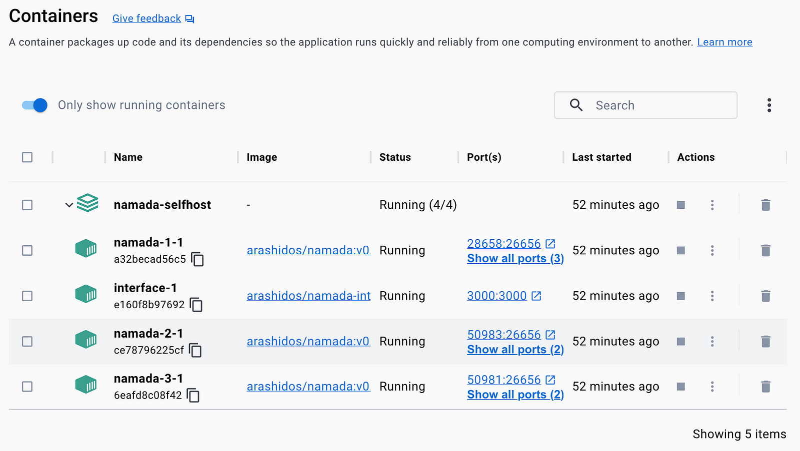

# Namada Walkthroughs

To be able to follow our walkthroughs, a compiler, a virtualisation platform, a package manager and other infrastructure is needed

## Basic Infrastructure

The following base components are required:

* Apple's OS/X operating system. This recipe is known to work on Ventura 13.6.1 so if your OS version differs, you mileage may vary
* the [Homebrew](https://brew.sh) package manager (see link for install instructions)
* [Docker Desktop](https://www.docker.com/products/docker-desktop/) - a virtual machine host that makes our process significantly easier. Whilst not strictly necessary (you can compile a node from code or even get binaries), Docker allows us to run a testnet hassle-free and the process works flawlessly
* You'll also need git, which you can install by installing the command-line tools for [XCode](https://developer.apple.com/xcode/), or can be installed like this:
```bash
brew install git
```

## Running a Local Chain (in Docker containers)

The first thing we need to do is run a local chain we can connect to. For the sake of this document, we'll run [Campfire](https://knowabl.notion.site/Campfire-testnet-5e4c1df53ab64b818a55bfcf36ccc550), one of a number of testnets available, which runs as a collection of Docker containers, thanks to the Namada [Selfhost](https://github.com/0x4r45h/namada-selfhost) project. First let's grab it from Github as shown below:

```bash
git clone https://github.com/0x4r45h/namada-selfhost.git
cd namada-selfhost
```

The project comes with a sample configuration file which must be renamed for use.  Please note that for this recipe to work, the version of Namada the orchestrator runs and this recipe is known to work with is set as shown below:

```bash
ver="v0.31.0"
sed -e "s/^NAMADA_TAG=.*/NAMADA_TAG=$ver/" .env.sample > .env
```

We now let the orchestrator run the validator nodes for us:

```bash
docker compose pull   # loads all the images (may take a little while)
docker compose up -d  # runs the node
cd ..                 # don't forget this!
```

and, if you look in the Docker Desktop app will look something like:



The chain will take a little while to come up (but it's far faster than running a public network which make take a much as 20 hours to sync) and you can check its status with the command below. When the result is `false`, you're ready to go!

```bash
function namada_status() {
    curl -s http://127.0.0.1:26657/status |jq .result
}
namada_status |jq -r .sync_info.catching_up
```

If you don't have `jq` installed, Brew can do it for you:

```bash
brew install jq
```

## Installing Local Binaries

For development purposes we cannot work inside the containers, so having binaries locally installed makes sense. Let's grab these from Github² and put them into a directory in our path (they must be the same version as that run by the orchestrator):

```bash
loc="https://github.com/anoma/namada/releases/download/$ver/namada-$ver-Darwin-x86_64.tar.gz"
curl -L $loc |tar xzvf -
cp $(echo $loc |sed 's/.*\///; s/\.tar\.gz$//')/namada* /usr/local/bin
```

now make sure you've got the right version:

```bash
namada --version
```

## Joining the Chain

We can now connect our binaries to the local validators by joining the local chain. The _chain id_ is handily provided to us by a service running on the first validator on port 8123 (this port number is internal to the container but it's mapped to a local port by Docker, which the code below looks up)

```bash
# fetch chain-id

node=namada-selfhost-namada-1-1
port=$(docker ps -f name=$node --format 'json {{.Ports}}' |perl -ne '/:(\d+)->8123/; print $1')
cfg_srv=http://127.0.0.1:$port/
chain_id=$(curl -sL $cfg_srv |perl -ne 'print $1 if /href="(.*?)\.tar.gz/')

# join the network

export NAMADA_NETWORK_CONFIGS_SERVER=$cfg_srv
namada client utils join-network --chain-id $chain_id
```

The above will create a directory at `~/Library/Application Support/Namada` containing genesis files and connection information for your chain. In my case, the directory is called `local.73532805d0f0897a687825d1`

## Setting Up and Funding the Wallets

We create two _keypairs_ or _accounts_ in our wallet: _donor_ (which we'll send from), and _charity_ (that we'll send to):

```bash
alias wallet-gen="namada wallet gen --unsafe-dont-encrypt --alias"
wallet-gen donor
wallet gen charity

# you can show existing wallets with
namada wallet list
```

Please note that because these keys are for development purposes, security is not a concern. The `--unsafe-dont-encrypt` switch saves you from having to enter and remember an encryption password. Additionally, the commands above will generate BIP39 phrases that you would ordinarily save somewhere, but as you'll never need to restore these keys, saving them in unnecessary

Next we need some coin. Thankfully the validators come preloaded with NAM tokens we can use for our test. The code below will fund the _donor_ account with 10 tokens:

```bash
# get the public address for the donor account

donor=$(namada wallet list --addr |perl -ne 'print $1 if /"donor":.*(tnam.*)/')

# transfer 10 tokens

w=namada-1-wallet
transfer="docker exec -it $node /usr/local/bin/namada client transfer"
$transfer --source $w --target $donor --token NAM --amount 10
```

...which will produce output like this:

> Transaction added to mempool.
> Wrapper transaction hash: D51D8B1310A62E31522BE303653A3DC025765D17F55AC8EEDFA0446295315015
> Inner transaction hash: FFE3152914F6A2067C3DEF7CC1915F5D68B53D752757B81F9C16F9189EE35A4E
> Wrapper transaction accepted at height 7782. Used 22 gas.
> Waiting for inner transaction result...
> Transaction was successfully applied at height 7783. Used 7728 gas.

And now check your balance:
```bash
namada client balance --owner donor
```

However, before the _donor_ account can send transactions, its public key must be "revealed".  That is because when the account signs a transaction, the verifiers need to have the public key corresponding to the sending address and that public key cannot be generated from the address itself, therefore, a transaction has to be created that links the implicit address to the public key.  That is done like this:

```bash
donor_pk=$(namadaw find --alias=donor |perl -ne 'print $1 if /Public key:\s+(.*)/')
namada reveal-pk --public-key=$donor_pk
```

...which will generate output similar to this:

> Submitting a tx to reveal the public key for address tnam1qpqqnuh6yh624nut0sx2py4zwk7u487yks74fsg5...
> Transaction added to mempool.
> Wrapper transaction hash: 1648A4619A1A8CF080BF1FDEBC7CF7911CC7D0F43D7F48EB04F5B209AC6F7D53
> Inner transaction hash: 397B5200540533C560573CA454C43DA5F12046CEDAB8DF5DA04E1E81C5C5843C
> Wrapper transaction accepted at height 7313. Used 18 gas.
> Waiting for inner transaction result...
> Transaction was successfully applied at height 7314. Used 6978 gas.


## Developer Setup

Functionality on Namada is built on Rust, so you'll need the compiler installed. If you don't already have it, install it like this:

```bash
brew install rust
```

## Upgrading Your Infrastructure

As the network upgrades, you can keep up easily thanks to the [namada-selfhost](https://medium.com/r/?url=https%3A%2F%2Fgithub.com%2F0x4r45h%2Fnamada-selfhost) project. To upgrade should be as easy as (from the folder where you cloned the project):
```bash
git pull               # perform in the folder where the project was cloned
docker compose down -v # the -v removes old volumes
docker compose up -d   # restart services
```

However, don't forget to also update your CLI binaries and the SDK!
